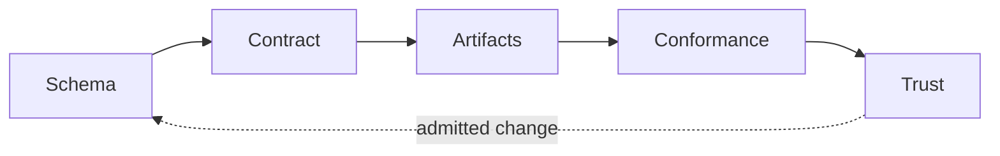

# Procedural Dungeon Generator with Dynamic Fog of War

> Governed review projection
>
> Contract: `procedural-dungeon-fog-of-war.v1` | Version: `1.13.0` | Status: `admitted`

## Future-State Preview

One admitted contract projects the complete playable dungeon artifact and the architecture review document used to inspect it.

The review document is derived from structured contract authority, so its artifact inventory, projection bindings, and trust vocabulary cannot drift independently from the shipped game file.

## Reviewer Perspective

As a gameplay and architecture reviewer, I need to confirm the map generator, movement rules, and raycast fog of war are exactly the admitted authority before the team signs off, so that the single HTML deliverable can be trusted to match this contract without re-reading its full source by hand.

## Governing Loop



## Contract Authority

| Coordinate | Admitted value |
| --- | --- |
| Contract type | `governed-artifact-contract.v1` |
| Contract ID | `procedural-dungeon-fog-of-war.v1` |
| Contract version | `1.13.0` |
| Contract status | `admitted` |
| Engine | `governed-artifact-engine.0.20.0` / `sha256:776a241c92c4eb5d7dd1707a8513359c984b8b4effdf42964984f8555cee89f8` |
| Schema identity | `https://canonical.local/schemas/governed-artifact-contract.schema.json` |
| Schema digest | `sha256:1243e31ec2fe9443fd355ab8ce4361d8046816b2924445dbf5c28337706b117b` |
| Conformance profile | `closed-world-artifact-conformance.v8` / `sha256:29387d6e10b6ff4f2c79db1e1cd640b84f18052246e42547a43d1a0cd19a26a2` |
| Projector registry | `governed-artifact-projector-registry.v1` / `sha256:68f46ba39dfb15ddd970759e212299e36f7695fea5f00ffe4a2e62234f5b09bf` |
| Verifier registry | `governed-artifact-verifier-registry.v1` / `sha256:9001a6ffe24768e4e0ffa8cbbf545e72343052e693e80736a5bd8ca818e89c14` |
| Migration registry | `governed-artifact-migration-registry.v1` / `sha256:16d9c61d42789f099e75c421322a288999e5ec7c0a540fa2281f8368efc64b56` |

## Semantic Subject

| Coordinate | Admitted value |
| --- | --- |
| Subject type | `artifact-family` |
| Subject ID | `procedural-dungeon-fog-of-war.v1` |
| Purpose | Deliver a self-contained, dependency-free procedural dungeon generator with Bresenham raycast fog of war as one browser-playable HTML artifact. |

Structured subject authority:

```json
{
  "canvasSizePx": 600,
  "colorPalette": {
    "hiddenFogOfWar": "#000000",
    "player": "#55ff33",
    "visibleFloor": "#9a8c98",
    "visibleWall": "#4a4e69"
  },
  "controls": [
    "ArrowUp",
    "ArrowDown",
    "ArrowLeft",
    "ArrowRight",
    "w",
    "a",
    "s",
    "d"
  ],
  "gridDimensions": {
    "heightTiles": 60,
    "tileSizePx": 10,
    "widthTiles": 60
  },
  "mapGenerationEngine": "binary-space-partitioning",
  "visionRadiusTiles": 9
}
```

## Artifact Family

| Artifact | Kind | Purpose | Relative path | Media type | Ownership | Mutability |
| --- | --- | --- | --- | --- | --- | --- |
| `dungeon-game.v1` | `html-document` | Renders the playable procedural dungeon: BSP map generation, keyboard movement, and Bresenham raycast fog-of-war revelation. | `index.html` | `text/html` | `contract-owned` | `replace-by-projection` |
| `dungeon-family-readme.v1` | `markdown-document` | Projects the complete contract authority into an architecture review document for team sign-off. | `README.md` | `text/markdown` | `contract-owned` | `replace-by-projection` |

### Proof Requirements

| Artifact | Verifiers | Requirements |
| --- | --- | --- |
| `dungeon-game.v1` | `content-digest-verifier.v1`, `forbidden-text-verifier.v1` | content digest; forbidden text: TODO, FIXME, implement logic here, placeholder |
| `dungeon-family-readme.v1` | `content-digest-verifier.v1`, `markdown-section-verifier.v1` | content digest; sections: # Procedural Dungeon Generator with Dynamic Fog of War, ## Future-State Preview, ## Reviewer Perspective, ## Governing Loop, ## Contract Authority, ## Semantic Subject, ## Artifact Family, ## Projection Authorities, ## Dependency Authorities, ## Effect Authorities, ## Runtime Authorities, ## Source Authority Closures, ## Authority Closure Profile, ## Artifact Scope Authority, ## Operation Authorities, ## Artifact Relationships, ## Exclusions, ## Conformance Evaluation, ## Terminal Dispositions, ## Receipt Requirements, ## Claim Policies, ## Review Checklist |

Content digests and byte lengths remain in the JSON contract. They are excluded from this review projection so the review artifact never becomes an input to its own content commitment.

## Projection Authorities

| Artifact | Mode | Projector | Authority | Authority type |
| --- | --- | --- | --- | --- |
| `dungeon-game.v1` | `projected` | `utf8-text-projector.v1` | `dungeon-game-authority.v1` | `utf8-text.v1` |
| `dungeon-family-readme.v1` | `projected` | `governed-artifact-contract-markdown-projector.v1` | `dungeon-family-readme-authority.v1` | `governed-artifact-contract-markdown.v1` |

## Dependency Authorities

No dependency authorities are declared.

## Effect Authorities

No effect authorities are declared.

## Runtime Authorities

No runtime authorities are declared.

## Source Authority Closures

No source authority closures are declared.

## Authority Closure Profile

The following closed-world authority posture is supplied by the content-addressed conformance profile. Exact coverage includes explicitly empty authority collections.

```json
{
  "admission": {
    "requiredDisposition": "ARTIFACT_AUTHORITY_CLOSED"
  },
  "authorityType": "closed-world-authority-closure.v1",
  "coverage": {
    "artifactPaths": "exact",
    "artifactScope": "exact",
    "claimProofRequirements": "exact",
    "decisions": "exact",
    "declarations": "exact",
    "dependencies": "exact",
    "dependencyImports": "exact",
    "dependencyInvocations": "exact",
    "effects": "exact",
    "failurePolicies": "exact",
    "iterations": "exact",
    "ontologyAuthorities": "exact",
    "ontologyExecutionBindings": "exact",
    "operationAuthorities": "exact",
    "projectionMappings": "exact",
    "responsibilities": "exact",
    "resultContracts": "exact",
    "runtimeAuthorities": "exact",
    "semanticEdges": "exact"
  },
  "resolution": {
    "ambientAuthority": "forbidden",
    "ambiguousObservations": "reject",
    "cardinality": "exactly-one",
    "missingDeclaredAuthorities": "reject",
    "undeclaredObservations": "reject",
    "unresolvedObservations": "reject"
  }
}
```

## Artifact Scope Authority

The governed path set below defines inventory authority. Paths outside it receive the declared outside-authority posture without implicit ignore rules.

```json
{
  "artifactRoot": "procedural-dungeon-fog-of-war",
  "governedDirectories": [],
  "inventoryMode": "exclusive-subtree",
  "outsideScopePosture": "outside-authority",
  "requiredDisposition": "ARTIFACT_SCOPE_CLOSED",
  "resolvedGovernedPathSet": [
    {
      "authorityId": "dungeon-game.v1",
      "pathKind": "artifact",
      "relativePath": "index.html"
    },
    {
      "authorityId": "dungeon-family-readme.v1",
      "pathKind": "artifact",
      "relativePath": "README.md"
    }
  ],
  "scopeType": "exclusive-artifact-subtree.v1",
  "workspaceRoot": "."
}
```

## Operation Authorities

The contract is the sole authored change authority. Governed artifacts are replace-only projections, and proof is observational.

```json
{
  "authoredMutation": {
    "governedArtifacts": "forbidden",
    "posture": "sole-authored-change-authority",
    "target": "contract"
  },
  "authorityType": "governed-operation-authorities.v3",
  "bodyPurity": {
    "admittedAuthorityTypes": [
      "semantic-projection-authority.v1",
      "semantic-execution-bundle.v1"
    ],
    "allowedExecutableForms": [
      "single-semantic-invocation",
      "direct-return",
      "declared-port-binding"
    ],
    "applicability": "artifacts-bound-to-semantic-authority-executor-port",
    "consumerRelaxation": "forbidden",
    "exactCardinality": {
      "exportedResponsibilities": 1,
      "resultFlows": 1,
      "semanticInvocations": 1
    },
    "executionPortEffect": "execute-semantic-authority",
    "forbiddenExecutableMechanics": [
      "branch",
      "iteration",
      "exception-handling",
      "throw",
      "object-construction",
      "serialization",
      "normalization",
      "validation",
      "fallback",
      "retry",
      "state-mutation"
    ],
    "profileType": "semantic-execution-body.v2",
    "semanticAuthorityLocation": "contract"
  },
  "migration": {
    "artifactProjection": "forbidden",
    "mode": "candidate-first",
    "operation": "migrate",
    "sourceInterpretation": "historical-schema-digest",
    "targetMutation": "contract-only",
    "trustIssuance": "forbidden",
    "writeMode": "explicit-only"
  },
  "mutationAuthority": {
    "authorityType": "single-source-mutation-authority.v1",
    "consumerAuthoredAuthority": {
      "cardinality": "exactly-one",
      "source": "contract",
      "target": "contract"
    },
    "controlEvidenceMutation": {
      "createOrReplace": "contract-declared-control-paths-only",
      "remove": "forbidden"
    },
    "derivedContractMutation": {
      "admittedOperations": [
        "migrate",
        "reconcile"
      ],
      "target": "contract"
    },
    "governedArtifactMutation": {
      "authoritySource": "validated-contract",
      "create": "declared-projections-only",
      "interpretationBase": "digest-bound",
      "remove": "forbidden",
      "replace": "declared-projections-only",
      "undeclaredState": "observe-and-reject"
    }
  },
  "projection": {
    "artifactPosture": "replace-by-projection",
    "operation": "project",
    "subjectMutation": "declared-projections-only",
    "writeMode": "explicit-only"
  },
  "proof": {
    "artifactProjection": "forbidden",
    "declaredEvaluations": "read-only",
    "mode": "read-only",
    "mutationDisposition": "EVALUATION_INVALIDATED_BY_MUTATION",
    "operation": "prove",
    "receiptTarget": "outside-governed-subject",
    "receiptWrite": "explicit-only",
    "requiredSubjectDisposition": "PROOF_SUBJECT_UNCHANGED",
    "subjectMutation": "forbidden"
  },
  "reconciliation": {
    "artifactProjection": "forbidden",
    "candidateProjection": "in-memory",
    "contractMutation": "commitment-fields-only",
    "mode": "candidate-first",
    "operation": "reconcile",
    "trustIssuance": "forbidden",
    "writeMode": "explicit-only"
  }
}
```

## Artifact Relationships

| Source artifact | Relationship | Target artifact |
| --- | --- | --- |
| `dungeon-game.v1` | `documents` | `dungeon-family-readme.v1` |
| `dungeon-family-readme.v1` | `documents` | `dungeon-game.v1` |

## Exclusions

No entries are declared.

## Conformance Evaluation

Fail closed: `true`

Evaluation order:

1. `validate-contract`
2. `resolve-artifact-plan`
3. `observe-artifact-state`
4. `classify-workspace-paths`
5. `resolve-design-authority`
6. `resolve-artifact-lineage`
7. `evaluate-artifact-inventory`
8. `evaluate-projection-identity`
9. `evaluate-authority-closure`
10. `evaluate-ontology-authority`
11. `evaluate-semantic-execution-bodies`
12. `evaluate-artifact-content`
13. `evaluate-artifact-structure`
14. `evaluate-artifact-freshness`
15. `evaluate-artifact-relationships`
16. `evaluate-declared-commands`
17. `verify-proof-subject-stability`
18. `issue-trust-disposition`

Declared command evaluations:

No command evaluations are declared.

## Terminal Dispositions

Contract validation:

- `CONTRACT_VALID`
- `CONTRACT_INVALID`
- `SCHEMA_NOT_ADMITTED`
- `SCHEMA_DIGEST_MISMATCH`

Artifact conformance:

- `ARTIFACT_MISSING`
- `ARTIFACT_UNDECLARED`
- `ARTIFACT_CONTENT_MISMATCH`
- `ARTIFACT_STRUCTURE_MISMATCH`
- `ARTIFACT_STALE`
- `PROJECTION_IDENTITY_MISMATCH`
- `ARTIFACT_ESCAPES_CONTRACT`
- `EVALUATION_INVALIDATED_BY_MUTATION`
- `ONTOLOGY_AUTHORITY_CLOSED`
- `SEMANTIC_EXECUTION_BODY_CLOSED`
- `CONTRACT_AUTHORITY_CLOSED`
- `WORKSPACE_AUTHORITY_CLOSED`
- `WORKSPACE_AUTHORITY_OPEN`
- `CANONICAL_LINEAGE_CLOSED`
- `CANONICAL_LINEAGE_OPEN`
- `ARTIFACT_PROVENANCE_SEALED`
- `DESIGN_AUTHORITY_CLOSED`
- `DESIGN_AUTHORITY_OPEN`

Trust postures:

- `CONFORMS`
- `DRIFTED`
- `MISSING`
- `EXTRA`
- `STALE`
- `CONTAMINATED`
- `NOT_EVALUATED`

Trust dispositions:

- `TRUSTED`
- `REJECTED`
- `NOT_EVALUATED`

## Receipt Requirements

| Evidence record | Type | Relative path |
| --- | --- | --- |
| Projection ledger | `governed-artifact-projection-ledger.v1` | `.governance/projections/procedural-dungeon-fog-of-war.ledger.json` |
| Conformance receipt | `governed-artifact-conformance-receipt.v1` | `.governance/receipts/procedural-dungeon-fog-of-war.receipt.json` |

Projection-ledger evidence:

- `contract-identity`
- `interpretation-base`
- `projector-registry-identity`
- `artifact-scope-authority`
- `authority-closure-profile`
- `operation-authorities`
- `dependency-authorities`
- `effect-authorities`
- `runtime-authorities`
- `source-authorities`
- `ontology-authorities`
- `artifact-projection-identities`
- `artifact-content-commitments`
- `workspace-authority`
- `canonical-lineage`
- `conversation-design-authority`

Conformance-receipt evidence:

- `contract-identity`
- `interpretation-base`
- `schema-identity`
- `registry-identities`
- `artifact-observations`
- `projection-identity`
- `artifact-scope-authority`
- `artifact-scope-observation`
- `authority-closure-profile`
- `authority-closure-disposition`
- `operation-authorities`
- `ontology-authorities`
- `proof-subject-stability`
- `source-authority-observations`
- `conformance-findings`
- `claim-policies`
- `trust-disposition`
- `workspace-authority`
- `canonical-lineage`
- `conversation-design-authority`

## Claim Policies

| Claim authority | Admitted claim | Required conformance | Required authority closure | Required artifact scope | Required proof | Required trust |
| --- | --- | --- | --- | --- | --- | --- |
| `dungeon-family-complete.v1` | `COMPLETE` | `CONTRACT_AUTHORITY_CLOSED` | `ARTIFACT_AUTHORITY_CLOSED` | `ARTIFACT_SCOPE_CLOSED` | `PROOF_COMPLETE` | `TRUSTED` |
| `dungeon-contract-authority-closed.v1` | `CONTRACT_AUTHORITY_CLOSED` | `CONTRACT_AUTHORITY_CLOSED` | `ARTIFACT_AUTHORITY_CLOSED` | `ARTIFACT_SCOPE_CLOSED` | `PROOF_COMPLETE` | `TRUSTED` |
| `dungeon-family-trusted.v1` | `TRUSTED` | `CONTRACT_AUTHORITY_CLOSED` | `ARTIFACT_AUTHORITY_CLOSED` | `ARTIFACT_SCOPE_CLOSED` | `PROOF_COMPLETE` | `TRUSTED` |

## Review Checklist

- [ ] The map generator produces only connected floor tiles reachable from the player spawn point.
- [ ] The player moves exactly one tile per keypress and cannot step onto a wall tile.
- [ ] Every fog-of-war reveal traces a generalized Bresenham line from the player and stops at the first wall it hits.
- [ ] God Mode reveals every tile without mutating the persistent visibility grid.
- [ ] Regenerate Map rebuilds the layout, resets visibility, and respawns the player on a valid floor tile.
- [ ] The deliverable is one self-contained HTML file with no external libraries and no placeholder logic.
