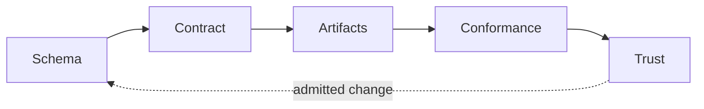

# Procedural Dungeon Generator: Governed Webpage Projection

> Governed review projection
>
> Contract: `procedural-dungeon-webpage.v1` | Version: `1.14.0` | Status: `admitted`

## Future-State Preview

One admitted contract projects the playable dungeon page, its three closed decision ontologies, their adapter modules, and the architecture review document used to inspect all of it.

Movement legality, per-cell render role, and keyboard-to-command translation are governed ontology data, not authored branching in the page; only procedural generation and the visibility sweep remain authored algorithms, and that boundary is recorded as an explicit contract deviation rather than left implicit.

## Reviewer Perspective

As a gameplay and architecture reviewer, I need to confirm which parts of the dungeon page are governed ontology decisions and which parts remain authored algorithms, and to verify both classes independently, so that the team can sign off on the page knowing exactly which behaviors are provably closed and which are explicitly, not silently, out of that closure.

## Governing Loop



## Contract Authority

| Coordinate | Admitted value |
| --- | --- |
| Contract type | `governed-artifact-contract.v1` |
| Contract ID | `procedural-dungeon-webpage.v1` |
| Contract version | `1.14.0` |
| Contract status | `admitted` |
| Engine | `governed-artifact-engine.0.21.0` / `sha256:2fc2f89e1ec5402d34ff86655f554b3e8add78a4bc6f6ba07086a86e8e927ad3` |
| Schema identity | `https://canonical.local/schemas/governed-artifact-contract.schema.json` |
| Schema digest | `sha256:beea2f82130ea5c4b419c70374deb0aaa0c7a98763a92eabac24894af635e8d4` |
| Conformance profile | `closed-world-artifact-conformance.v8` / `sha256:e3362972b4629c285cb9ef5474936379b6b87b7f4124dc5670927792f049b1f7` |
| Projector registry | `governed-artifact-projector-registry.v1` / `sha256:1ab8ec48c80324c862cf598813554847fc4224ecb146e8dbddf7d9b1efdb2785` |
| Verifier registry | `governed-artifact-verifier-registry.v1` / `sha256:fb7df5deb813be792c2da1fd573f2456236c5af17594001c803d2fc10899c17a` |
| Migration registry | `governed-artifact-migration-registry.v1` / `sha256:7b4e0ee1074288b095d6f71d7430299447a9498c40ceb14106c858b2991a766b` |

## Semantic Subject

| Coordinate | Admitted value |
| --- | --- |
| Subject type | `interactive-web-capability` |
| Subject ID | `procedural-dungeon-webpage.v1` |
| Purpose | Generate and interact with a connected dungeon whose application structure, presentation, state transitions, workflows, rendering projection, and specialized decisions are governed by context and ontology authorities. |

Structured subject authority:

```json
{
  "authoredAlgorithm": [],
  "closedLoop": [
    "ontology",
    "adapter",
    "browser-context",
    "webpage",
    "conformance",
    "trust"
  ],
  "ontologyOwned": [
    "resolve-player-movement",
    "resolve-cell-render-role",
    "translate-keyboard-command",
    "resolve-dungeon-topology",
    "rasterize-topology-into-grid",
    "calculate-visibility-sweep"
  ]
}
```

## Artifact Family

| Artifact | Kind | Purpose | Relative path | Media type | Ownership | Mutability |
| --- | --- | --- | --- | --- | --- | --- |
| `procedural-dungeon-webpage.v1` | `interactive-html-document` | Projects only an empty application root and one invocation of the governed collapsed application adapter; it owns no executable application mechanics. | `index.html` | `text/html` | `contract-owned` | `replace-by-projection` |
| `dungeon-movement-bundle.v1` | `deterministic-ontology-bundle` | Materializes the closed movement-resolution ontology as an executable bundle. | `contracts/dungeon-movement.bundle.json` | `application/json` | `contract-owned` | `replace-by-projection` |
| `dungeon-render-role-bundle.v1` | `deterministic-ontology-bundle` | Materializes the closed cell render-role ontology as an executable bundle. | `contracts/dungeon-render-role.bundle.json` | `application/json` | `contract-owned` | `replace-by-projection` |
| `dungeon-keyboard-command-bundle.v1` | `deterministic-ontology-bundle` | Materializes the closed keyboard-command ontology as an executable bundle. | `contracts/dungeon-keyboard-command.bundle.json` | `application/json` | `contract-owned` | `replace-by-projection` |
| `movement-adapter.v1` | `javascript-module` | Binds one declared movement request to the trusted movement-resolution ontology. | `src/movement-adapter.mjs` | `text/javascript` | `contract-owned` | `replace-by-projection` |
| `render-role-adapter.v1` | `javascript-module` | Binds one declared cell render request to the trusted render-role ontology. | `src/render-role-adapter.mjs` | `text/javascript` | `contract-owned` | `replace-by-projection` |
| `keyboard-command-adapter.v1` | `javascript-module` | Binds one declared keyboard request to the trusted keyboard-command ontology. | `src/keyboard-command-adapter.mjs` | `text/javascript` | `contract-owned` | `replace-by-projection` |
| `browser-context-authority.v1` | `canonical-json-value` | Owns the webpage document, presentation, state, event, workflow, rendering-frame, effect-binding, and ontology-selection semantics interpreted by the trusted browser application runtime. | `browser-context.json` | `application/json` | `contract-owned` | `replace-by-projection` |
| `browser-application-authority.v1` | `semantic-execution-authority` | Authorizes one direct browser-application projection from the declared browser port. | `contracts/procedural-dungeon-application.authority.json` | `application/json` | `contract-owned` | `replace-by-projection` |
| `browser-application-port-schema.v1` | `json-schema` | Constrains the browser port supplied to the aggregate page authority. | `contracts/browser-application-port.schema.json` | `application/schema+json` | `contract-owned` | `replace-by-projection` |
| `application-adapter.v1` | `javascript-module` | Binds the one aggregate browser-context semantic projection authority to the trusted browser application executor and directly returns its result. | `src/application-adapter.mjs` | `text/javascript` | `contract-owned` | `replace-by-projection` |
| `procedural-dungeon-webpage-readme.v1` | `markdown-document` | Projects the complete contract authority into an architecture review document for team sign-off. | `README.md` | `text/markdown` | `contract-owned` | `replace-by-projection` |
| `dungeon-topology-bundle.v1` | `deterministic-ontology-bundle` | Materializes the closed BSP region-partitioning ontology (a genuine branching worklist, not authored recursion) as an executable bundle. | `contracts/dungeon-topology.bundle.json` | `application/json` | `contract-owned` | `replace-by-projection` |
| `dungeon-rasterize-bundle.v1` | `deterministic-ontology-bundle` | Materializes the closed rasterization ontology (unified paint-rectangle containment sweep) as an executable bundle. | `contracts/dungeon-rasterize.bundle.json` | `application/json` | `contract-owned` | `replace-by-projection` |
| `dungeon-visibility-bundle.v1` | `deterministic-ontology-bundle` | Materializes the closed 76-ray Bresenham visibility-sweep ontology as an executable bundle. | `contracts/dungeon-visibility.bundle.json` | `application/json` | `contract-owned` | `replace-by-projection` |
| `topology-adapter.v1` | `javascript-module` | Binds one declared region-partition request to the trusted BSP topology ontology. | `src/topology-adapter.mjs` | `text/javascript` | `contract-owned` | `replace-by-projection` |
| `rasterize-adapter.v1` | `javascript-module` | Binds one declared paint-rectangle list to the trusted rasterization ontology. | `src/rasterize-adapter.mjs` | `text/javascript` | `contract-owned` | `replace-by-projection` |
| `visibility-adapter.v1` | `javascript-module` | Binds one declared visibility-sweep request to the trusted Bresenham visibility ontology. | `src/visibility-adapter.mjs` | `text/javascript` | `contract-owned` | `replace-by-projection` |

### Proof Requirements

| Artifact | Verifiers | Requirements |
| --- | --- | --- |
| `procedural-dungeon-webpage.v1` | `content-digest-verifier.v1`, `forbidden-text-verifier.v1` | content digest; forbidden text: TODO, FIXME, implement logic here, placeholder |
| `dungeon-movement-bundle.v1` | `content-digest-verifier.v1` | content digest |
| `dungeon-render-role-bundle.v1` | `content-digest-verifier.v1` | content digest |
| `dungeon-keyboard-command-bundle.v1` | `content-digest-verifier.v1` | content digest |
| `movement-adapter.v1` | `artifact-provenance-verifier.v1`, `authority-closure-verifier.v1`, `content-digest-verifier.v1`, `source-token-structure-verifier.v1` | content digest |
| `render-role-adapter.v1` | `artifact-provenance-verifier.v1`, `authority-closure-verifier.v1`, `content-digest-verifier.v1`, `source-token-structure-verifier.v1` | content digest |
| `keyboard-command-adapter.v1` | `artifact-provenance-verifier.v1`, `authority-closure-verifier.v1`, `content-digest-verifier.v1`, `source-token-structure-verifier.v1` | content digest |
| `browser-context-authority.v1` | `content-digest-verifier.v1` | content digest |
| `browser-application-authority.v1` | `content-digest-verifier.v1` | content digest |
| `browser-application-port-schema.v1` | `content-digest-verifier.v1`, `json-meta-schema-verifier.v1` | content digest; meta-schema |
| `application-adapter.v1` | `artifact-provenance-verifier.v1`, `authority-closure-verifier.v1`, `content-digest-verifier.v1`, `source-token-structure-verifier.v1` | content digest |
| `procedural-dungeon-webpage-readme.v1` | `content-digest-verifier.v1`, `markdown-section-verifier.v1` | content digest; sections: # Procedural Dungeon Generator: Governed Webpage Projection, ## Future-State Preview, ## Reviewer Perspective, ## Governing Loop, ## Contract Authority, ## Semantic Subject, ## Artifact Family, ## Projection Authorities, ## Dependency Authorities, ## Effect Authorities, ## Runtime Authorities, ## Source Authority Closures, ## Authority Closure Profile, ## Artifact Scope Authority, ## Operation Authorities, ## Artifact Relationships, ## Exclusions, ## Conformance Evaluation, ## Terminal Dispositions, ## Receipt Requirements, ## Claim Policies, ## Review Checklist |
| `dungeon-topology-bundle.v1` | `content-digest-verifier.v1` | content digest |
| `dungeon-rasterize-bundle.v1` | `content-digest-verifier.v1` | content digest |
| `dungeon-visibility-bundle.v1` | `content-digest-verifier.v1` | content digest |
| `topology-adapter.v1` | `artifact-provenance-verifier.v1`, `authority-closure-verifier.v1`, `content-digest-verifier.v1`, `source-token-structure-verifier.v1` | content digest |
| `rasterize-adapter.v1` | `artifact-provenance-verifier.v1`, `authority-closure-verifier.v1`, `content-digest-verifier.v1`, `source-token-structure-verifier.v1` | content digest |
| `visibility-adapter.v1` | `artifact-provenance-verifier.v1`, `authority-closure-verifier.v1`, `content-digest-verifier.v1`, `source-token-structure-verifier.v1` | content digest |

Content digests and byte lengths remain in the JSON contract. They are excluded from this review projection so the review artifact never becomes an input to its own content commitment.

## Projection Authorities

| Artifact | Mode | Projector | Authority | Authority type |
| --- | --- | --- | --- | --- |
| `procedural-dungeon-webpage.v1` | `projected` | `structured-html-document-projector.v1` | `procedural-dungeon-webpage-authority.v1` | `canonical-json-value.v1` |
| `dungeon-movement-bundle.v1` | `projected` | `bound-semantic-execution-authority-projector.v1` | `dungeon-movement-bundle.v1-authority` | `canonical-json-value.v1` |
| `dungeon-render-role-bundle.v1` | `projected` | `bound-semantic-execution-authority-projector.v1` | `dungeon-render-role-bundle.v1-authority` | `canonical-json-value.v1` |
| `dungeon-keyboard-command-bundle.v1` | `projected` | `bound-semantic-execution-authority-projector.v1` | `dungeon-keyboard-command-bundle.v1-authority` | `canonical-json-value.v1` |
| `movement-adapter.v1` | `projected` | `provenance-sealed-source-projector.v1` | `movement-adapter.v1-authority` | `lossless-source-tokens.v1` |
| `render-role-adapter.v1` | `projected` | `provenance-sealed-source-projector.v1` | `render-role-adapter.v1-authority` | `lossless-source-tokens.v1` |
| `keyboard-command-adapter.v1` | `projected` | `provenance-sealed-source-projector.v1` | `keyboard-command-adapter.v1-authority` | `lossless-source-tokens.v1` |
| `browser-context-authority.v1` | `projected` | `canonical-json-value-projector.v1` | `browser-context-authority.v1-authority` | `canonical-json-value.v1` |
| `browser-application-authority.v1` | `projected` | `canonical-json-value-projector.v1` | `browser-application-semantic-authority.v1` | `canonical-json-value.v1` |
| `browser-application-port-schema.v1` | `projected` | `canonical-json-value-projector.v1` | `browser-application-port-schema-authority.v1` | `canonical-json-value.v1` |
| `application-adapter.v1` | `projected` | `provenance-sealed-source-projector.v1` | `application-adapter-source-authority.v1` | `lossless-source-tokens.v1` |
| `procedural-dungeon-webpage-readme.v1` | `projected` | `governed-artifact-contract-markdown-projector.v1` | `procedural-dungeon-webpage-readme-authority.v1` | `governed-artifact-contract-markdown.v1` |
| `dungeon-topology-bundle.v1` | `projected` | `bound-semantic-execution-authority-projector.v1` | `dungeon-topology-bundle.v1-authority` | `canonical-json-value.v1` |
| `dungeon-rasterize-bundle.v1` | `projected` | `bound-semantic-execution-authority-projector.v1` | `dungeon-rasterize-bundle.v1-authority` | `canonical-json-value.v1` |
| `dungeon-visibility-bundle.v1` | `projected` | `bound-semantic-execution-authority-projector.v1` | `dungeon-visibility-bundle.v1-authority` | `canonical-json-value.v1` |
| `topology-adapter.v1` | `projected` | `provenance-sealed-source-projector.v1` | `topology-adapter.v1-authority` | `lossless-source-tokens.v1` |
| `rasterize-adapter.v1` | `projected` | `provenance-sealed-source-projector.v1` | `rasterize-adapter.v1-authority` | `lossless-source-tokens.v1` |
| `visibility-adapter.v1` | `projected` | `provenance-sealed-source-projector.v1` | `visibility-adapter.v1-authority` | `lossless-source-tokens.v1` |

## Dependency Authorities

| Dependency | Specifier | Allowed imports | Allowed invocations | Used by artifacts | Authority |
| --- | --- | --- | --- | --- | --- |
| `semantic-authority-runtime.v1` | `contract-driven-artifact-governance-engine` | `executeSemanticAuthority` | `executeSemanticAuthority` | `movement-adapter.v1`, `render-role-adapter.v1`, `keyboard-command-adapter.v1`, `topology-adapter.v1`, `rasterize-adapter.v1`, `visibility-adapter.v1` | `semantic-authority-runtime.v1` / `execute-semantic-authority` |
| `movement-bundle-data.v1` | `../contracts/dungeon-movement.bundle.json` | `default` |  | `movement-adapter.v1`, `application-adapter.v1` | `movement-bundle-data.v1` / `read-semantic-authority` |
| `render-role-bundle-data.v1` | `../contracts/dungeon-render-role.bundle.json` | `default` |  | `render-role-adapter.v1`, `application-adapter.v1` | `render-role-bundle-data.v1` / `read-semantic-authority` |
| `keyboard-command-bundle-data.v1` | `../contracts/dungeon-keyboard-command.bundle.json` | `default` |  | `keyboard-command-adapter.v1`, `application-adapter.v1` | `keyboard-command-bundle-data.v1` / `read-semantic-authority` |
| `topology-bundle-data.v1` | `../contracts/dungeon-topology.bundle.json` | `default` |  | `topology-adapter.v1`, `application-adapter.v1` | `topology-bundle-data.v1` / `read-semantic-authority` |
| `rasterize-bundle-data.v1` | `../contracts/dungeon-rasterize.bundle.json` | `default` |  | `rasterize-adapter.v1`, `application-adapter.v1` | `rasterize-bundle-data.v1` / `read-semantic-authority` |
| `visibility-bundle-data.v1` | `../contracts/dungeon-visibility.bundle.json` | `default` |  | `visibility-adapter.v1`, `application-adapter.v1` | `visibility-bundle-data.v1` / `read-semantic-authority` |
| `browser-application-runtime.v1` | `../../lib/browser-application-runtime.mjs` | `executeBrowserApplication` | `executeBrowserApplication` | `application-adapter.v1` | `browser-application-runtime.v1` / `execute-semantic-authority` |
| `browser-application-authority-data.v1` | `../contracts/procedural-dungeon-application.authority.json` | `default` |  | `application-adapter.v1` | `browser-application-authority-data.v1` / `read-semantic-authority` |
| `browser-context-data.v1` | `../browser-context.json` | `default` |  | `application-adapter.v1` | `browser-context-data.v1` / `read-semantic-authority` |

## Effect Authorities

No effect authorities are declared.

## Runtime Authorities

| Runtime authority | Invocation | Used by artifacts | Purpose |
| --- | --- | --- | --- |
| `semantic-authority-runtime.v1` | `executeSemanticAuthority` | `movement-adapter.v1`, `render-role-adapter.v1`, `keyboard-command-adapter.v1`, `topology-adapter.v1`, `rasterize-adapter.v1`, `visibility-adapter.v1` | Executes the contract-declared movement, render-role, keyboard-command, BSP topology, rasterization, and visibility ontologies. |
| `browser-application-runtime.v1` | `executeBrowserApplication` | `application-adapter.v1` | Interprets one aggregate semantic projection authority against a supplied browser port; all capability meaning remains declared in that authority and its selected ontology bundles. |

## Source Authority Closures

| Artifact | Object-graph closure | Responsibilities | Semantic edges | Decisions | Iterations | Failure policies | Projection mappings | Result contracts |
| --- | --- | --- | --- | --- | --- | --- | --- | --- |
| `movement-adapter.v1` | `invocation-only.v1` | `movement-adapter-module.v1`, `resolve-movement.v1` | `bind-movement-bundle-data.v1-edge.v1`, `execute-resolve-movement-semantics.v1` |  |  |  |  | `movement-result.v1` |
| `render-role-adapter.v1` | `invocation-only.v1` | `render-role-adapter-module.v1`, `resolve-render-role.v1` | `bind-render-role-bundle-data.v1-edge.v1`, `execute-resolve-render-role-semantics.v1` |  |  |  |  | `render-role-result.v1` |
| `keyboard-command-adapter.v1` | `invocation-only.v1` | `keyboard-command-adapter-module.v1`, `resolve-keyboard-command.v1` | `bind-keyboard-command-bundle-data.v1-edge.v1`, `execute-resolve-keyboard-command-semantics.v1` |  |  |  |  | `keyboard-command-result.v1` |
| `application-adapter.v1` | `invocation-only.v1` | `application-adapter-module.v1`, `start-procedural-dungeon-page.v1` | `execute-browser-application-semantics.v1` |  |  | `browser-application-projection-failure.v1` | `browser-application-projection.v1` | `browser-application-result.v1` |
| `topology-adapter.v1` | `invocation-only.v1` | `topology-adapter-module.v1`, `resolve-topology.v1` | `bind-topology-bundle-data.v1-edge.v1`, `execute-resolve-topology-semantics.v1` |  |  |  |  | `topology-result.v1` |
| `rasterize-adapter.v1` | `invocation-only.v1` | `rasterize-adapter-module.v1`, `resolve-rasterization.v1` | `bind-rasterize-bundle-data.v1-edge.v1`, `execute-resolve-rasterization-semantics.v1` |  |  |  |  | `rasterize-result.v1` |
| `visibility-adapter.v1` | `invocation-only.v1` | `visibility-adapter-module.v1`, `resolve-visibility.v1` | `bind-visibility-bundle-data.v1-edge.v1`, `execute-resolve-visibility-semantics.v1` |  |  |  |  | `visibility-result.v1` |

## Authority Closure Profile

The following closed-world authority posture is supplied by the content-addressed conformance profile. Exact coverage includes explicitly empty authority collections.

```json
{
  "admission": {
    "requiredDisposition": "ARTIFACT_AUTHORITY_CLOSED"
  },
  "authorityType": "closed-world-authority-closure.v1",
  "coverage": {
    "artifactPaths": "exact",
    "artifactScope": "exact",
    "claimProofRequirements": "exact",
    "decisions": "exact",
    "declarations": "exact",
    "dependencies": "exact",
    "dependencyImports": "exact",
    "dependencyInvocations": "exact",
    "effects": "exact",
    "failurePolicies": "exact",
    "iterations": "exact",
    "ontologyAuthorities": "exact",
    "ontologyExecutionBindings": "exact",
    "operationAuthorities": "exact",
    "projectionMappings": "exact",
    "responsibilities": "exact",
    "resultContracts": "exact",
    "runtimeAuthorities": "exact",
    "semanticEdges": "exact"
  },
  "resolution": {
    "ambientAuthority": "forbidden",
    "ambiguousObservations": "reject",
    "cardinality": "exactly-one",
    "missingDeclaredAuthorities": "reject",
    "undeclaredObservations": "reject",
    "unresolvedObservations": "reject"
  }
}
```

## Artifact Scope Authority

The governed path set below defines inventory authority. Paths outside it receive the declared outside-authority posture without implicit ignore rules.

```json
{
  "artifactRoot": ".",
  "governedDirectories": [],
  "inventoryMode": "declared-paths",
  "outsideScopePosture": "outside-authority",
  "requiredDisposition": "ARTIFACT_SCOPE_CLOSED",
  "resolvedGovernedPathSet": [
    {
      "authorityId": "browser-context-authority.v1",
      "pathKind": "artifact",
      "relativePath": "browser-context.json"
    },
    {
      "authorityId": "browser-application-port-schema.v1",
      "pathKind": "artifact",
      "relativePath": "contracts/browser-application-port.schema.json"
    },
    {
      "authorityId": "dungeon-keyboard-command-bundle.v1",
      "pathKind": "artifact",
      "relativePath": "contracts/dungeon-keyboard-command.bundle.json"
    },
    {
      "authorityId": "dungeon-movement-bundle.v1",
      "pathKind": "artifact",
      "relativePath": "contracts/dungeon-movement.bundle.json"
    },
    {
      "authorityId": "dungeon-rasterize-bundle.v1",
      "pathKind": "artifact",
      "relativePath": "contracts/dungeon-rasterize.bundle.json"
    },
    {
      "authorityId": "dungeon-render-role-bundle.v1",
      "pathKind": "artifact",
      "relativePath": "contracts/dungeon-render-role.bundle.json"
    },
    {
      "authorityId": "dungeon-topology-bundle.v1",
      "pathKind": "artifact",
      "relativePath": "contracts/dungeon-topology.bundle.json"
    },
    {
      "authorityId": "dungeon-visibility-bundle.v1",
      "pathKind": "artifact",
      "relativePath": "contracts/dungeon-visibility.bundle.json"
    },
    {
      "authorityId": "browser-application-authority.v1",
      "pathKind": "artifact",
      "relativePath": "contracts/procedural-dungeon-application.authority.json"
    },
    {
      "authorityId": "procedural-dungeon-webpage.v1",
      "pathKind": "artifact",
      "relativePath": "index.html"
    },
    {
      "authorityId": "procedural-dungeon-webpage-readme.v1",
      "pathKind": "artifact",
      "relativePath": "README.md"
    },
    {
      "authorityId": "application-adapter.v1",
      "pathKind": "artifact",
      "relativePath": "src/application-adapter.mjs"
    },
    {
      "authorityId": "keyboard-command-adapter.v1",
      "pathKind": "artifact",
      "relativePath": "src/keyboard-command-adapter.mjs"
    },
    {
      "authorityId": "movement-adapter.v1",
      "pathKind": "artifact",
      "relativePath": "src/movement-adapter.mjs"
    },
    {
      "authorityId": "rasterize-adapter.v1",
      "pathKind": "artifact",
      "relativePath": "src/rasterize-adapter.mjs"
    },
    {
      "authorityId": "render-role-adapter.v1",
      "pathKind": "artifact",
      "relativePath": "src/render-role-adapter.mjs"
    },
    {
      "authorityId": "topology-adapter.v1",
      "pathKind": "artifact",
      "relativePath": "src/topology-adapter.mjs"
    },
    {
      "authorityId": "visibility-adapter.v1",
      "pathKind": "artifact",
      "relativePath": "src/visibility-adapter.mjs"
    }
  ],
  "scopeType": "declared-artifact-scope.v1",
  "workspaceRoot": "."
}
```

## Operation Authorities

The contract is the sole authored change authority. Governed artifacts are replace-only projections, and proof is observational.

```json
{
  "authoredMutation": {
    "governedArtifacts": "forbidden",
    "posture": "sole-authored-change-authority",
    "target": "contract"
  },
  "authorityType": "governed-operation-authorities.v3",
  "bodyPurity": {
    "admittedAuthorityTypes": [
      "semantic-projection-authority.v1",
      "semantic-execution-bundle.v1"
    ],
    "allowedExecutableForms": [
      "single-semantic-invocation",
      "direct-return",
      "declared-port-binding"
    ],
    "applicability": "artifacts-bound-to-semantic-authority-executor-port",
    "consumerRelaxation": "forbidden",
    "exactCardinality": {
      "exportedResponsibilities": 1,
      "resultFlows": 1,
      "semanticInvocations": 1
    },
    "executionPortEffect": "execute-semantic-authority",
    "forbiddenExecutableMechanics": [
      "branch",
      "iteration",
      "exception-handling",
      "throw",
      "object-construction",
      "serialization",
      "normalization",
      "validation",
      "fallback",
      "retry",
      "state-mutation",
      "meaning-hidden-in-text"
    ],
    "profileType": "semantic-execution-body.v2",
    "semanticAuthorityLocation": "contract"
  },
  "migration": {
    "artifactProjection": "forbidden",
    "mode": "candidate-first",
    "operation": "migrate",
    "sourceInterpretation": "historical-schema-digest",
    "targetMutation": "contract-only",
    "trustIssuance": "forbidden",
    "writeMode": "explicit-only"
  },
  "mutationAuthority": {
    "authorityType": "single-source-mutation-authority.v1",
    "consumerAuthoredAuthority": {
      "cardinality": "exactly-one",
      "source": "contract",
      "target": "contract"
    },
    "controlEvidenceMutation": {
      "createOrReplace": "contract-declared-control-paths-only",
      "remove": "forbidden"
    },
    "derivedContractMutation": {
      "admittedOperations": [
        "migrate",
        "reconcile"
      ],
      "target": "contract"
    },
    "governedArtifactMutation": {
      "authoritySource": "validated-contract",
      "create": "declared-projections-only",
      "interpretationBase": "digest-bound",
      "remove": "forbidden",
      "replace": "declared-projections-only",
      "undeclaredState": "observe-and-reject"
    }
  },
  "projection": {
    "artifactPosture": "replace-by-projection",
    "operation": "project",
    "subjectMutation": "declared-projections-only",
    "writeMode": "explicit-only"
  },
  "proof": {
    "artifactProjection": "forbidden",
    "declaredEvaluations": "read-only",
    "mode": "read-only",
    "mutationDisposition": "EVALUATION_INVALIDATED_BY_MUTATION",
    "operation": "prove",
    "receiptTarget": "outside-governed-subject",
    "receiptWrite": "explicit-only",
    "requiredSubjectDisposition": "PROOF_SUBJECT_UNCHANGED",
    "subjectMutation": "forbidden"
  },
  "reconciliation": {
    "artifactProjection": "forbidden",
    "candidateProjection": "in-memory",
    "contractMutation": "commitment-fields-only",
    "mode": "candidate-first",
    "operation": "reconcile",
    "trustIssuance": "forbidden",
    "writeMode": "explicit-only"
  }
}
```

## Artifact Relationships

| Source artifact | Relationship | Target artifact |
| --- | --- | --- |
| `procedural-dungeon-webpage.v1` | `invokes` | `application-adapter.v1` |
| `procedural-dungeon-webpage.v1` | `documents` | `procedural-dungeon-webpage-readme.v1` |
| `movement-adapter.v1` | `reads` | `dungeon-movement-bundle.v1` |
| `render-role-adapter.v1` | `reads` | `dungeon-render-role-bundle.v1` |
| `keyboard-command-adapter.v1` | `reads` | `dungeon-keyboard-command-bundle.v1` |
| `browser-context-authority.v1` | `reads` | `dungeon-keyboard-command-bundle.v1` |
| `browser-context-authority.v1` | `reads` | `dungeon-movement-bundle.v1` |
| `browser-context-authority.v1` | `reads` | `dungeon-rasterize-bundle.v1` |
| `browser-context-authority.v1` | `reads` | `dungeon-render-role-bundle.v1` |
| `browser-context-authority.v1` | `reads` | `dungeon-topology-bundle.v1` |
| `browser-context-authority.v1` | `reads` | `dungeon-visibility-bundle.v1` |
| `browser-application-authority.v1` | `reads` | `browser-application-port-schema.v1` |
| `application-adapter.v1` | `reads` | `browser-application-authority.v1` |
| `procedural-dungeon-webpage-readme.v1` | `documents` | `movement-adapter.v1` |
| `procedural-dungeon-webpage-readme.v1` | `documents` | `render-role-adapter.v1` |
| `procedural-dungeon-webpage-readme.v1` | `documents` | `keyboard-command-adapter.v1` |
| `procedural-dungeon-webpage-readme.v1` | `documents` | `procedural-dungeon-webpage.v1` |
| `topology-adapter.v1` | `reads` | `dungeon-topology-bundle.v1` |
| `rasterize-adapter.v1` | `reads` | `dungeon-rasterize-bundle.v1` |
| `visibility-adapter.v1` | `reads` | `dungeon-visibility-bundle.v1` |

## Exclusions

No entries are declared.

## Conformance Evaluation

Fail closed: `true`

Evaluation order:

1. `validate-contract`
2. `resolve-artifact-plan`
3. `observe-artifact-state`
4. `classify-workspace-paths`
5. `resolve-design-authority`
6. `resolve-artifact-lineage`
7. `evaluate-artifact-inventory`
8. `evaluate-projection-identity`
9. `evaluate-authority-closure`
10. `evaluate-ontology-authority`
11. `evaluate-semantic-execution-bodies`
12. `evaluate-structured-meaning-authority`
13. `evaluate-artifact-content`
14. `evaluate-artifact-structure`
15. `evaluate-artifact-freshness`
16. `evaluate-artifact-relationships`
17. `evaluate-declared-commands`
18. `verify-proof-subject-stability`
19. `issue-trust-disposition`

Declared command evaluations:

| Evaluation | Verifier | Command | Exit code | Required standard output |
| --- | --- | --- | --- | --- |
| `verify-dom-structure.v1` | `command-exit-verifier.v1` | `node ../verification-tools/verifies-dom-structure.mjs` | `0` | `DOM_STRUCTURE_CONFORMS` |
| `verify-collapsed-adapters.v1` | `command-exit-verifier.v1` | `node ../verification-tools/verifies-collapsed-adapters.mjs` | `0` | `COLLAPSED_BOOTSTRAP_CONFORMS` |
| `verify-semantic-equivalence.v1` | `command-exit-verifier.v1` | `node ../verification-tools/verifies-semantic-equivalence.mjs` | `0` | `SEMANTIC_EXECUTION_EQUIVALENCE_CONFORMS` |
| `verify-render-command-frame.v1` | `command-exit-verifier.v1` | `node ../verification-tools/verifies-render-command-frame.mjs` | `0` | `RENDER_COMMAND_FRAME_CONFORMS` |
| `verify-page-bootstrap-mechanics.v1` | `command-exit-verifier.v1` | `node ../verification-tools/verifies-page-bootstrap-mechanics.mjs` | `0` | `PAGE_BOOTSTRAP_MECHANICS_CONFORMS` |

## Terminal Dispositions

Contract validation:

- `CONTRACT_VALID`
- `CONTRACT_INVALID`
- `SCHEMA_NOT_ADMITTED`
- `SCHEMA_DIGEST_MISMATCH`

Artifact conformance:

- `ARTIFACT_MISSING`
- `ARTIFACT_UNDECLARED`
- `ARTIFACT_CONTENT_MISMATCH`
- `ARTIFACT_STRUCTURE_MISMATCH`
- `ARTIFACT_STALE`
- `PROJECTION_IDENTITY_MISMATCH`
- `ARTIFACT_ESCAPES_CONTRACT`
- `EVALUATION_INVALIDATED_BY_MUTATION`
- `ONTOLOGY_AUTHORITY_CLOSED`
- `SEMANTIC_EXECUTION_BODY_CLOSED`
- `CONTRACT_AUTHORITY_CLOSED`
- `WORKSPACE_AUTHORITY_CLOSED`
- `WORKSPACE_AUTHORITY_OPEN`
- `CANONICAL_LINEAGE_CLOSED`
- `CANONICAL_LINEAGE_OPEN`
- `ARTIFACT_PROVENANCE_SEALED`
- `DESIGN_AUTHORITY_CLOSED`
- `DESIGN_AUTHORITY_OPEN`

Trust postures:

- `CONFORMS`
- `DRIFTED`
- `MISSING`
- `EXTRA`
- `STALE`
- `CONTAMINATED`
- `NOT_EVALUATED`

Trust dispositions:

- `TRUSTED`
- `REJECTED`
- `NOT_EVALUATED`

## Receipt Requirements

| Evidence record | Type | Relative path |
| --- | --- | --- |
| Projection ledger | `governed-artifact-projection-ledger.v1` | `.governance/projections/procedural-dungeon-webpage.ledger.json` |
| Conformance receipt | `governed-artifact-conformance-receipt.v1` | `.governance/receipts/procedural-dungeon-webpage.receipt.json` |

Projection-ledger evidence:

- `contract-identity`
- `interpretation-base`
- `projector-registry-identity`
- `artifact-scope-authority`
- `authority-closure-profile`
- `operation-authorities`
- `dependency-authorities`
- `effect-authorities`
- `runtime-authorities`
- `source-authorities`
- `ontology-authorities`
- `artifact-projection-identities`
- `artifact-content-commitments`
- `workspace-authority`
- `canonical-lineage`
- `conversation-design-authority`

Conformance-receipt evidence:

- `contract-identity`
- `interpretation-base`
- `schema-identity`
- `registry-identities`
- `artifact-observations`
- `projection-identity`
- `artifact-scope-authority`
- `artifact-scope-observation`
- `authority-closure-profile`
- `authority-closure-disposition`
- `operation-authorities`
- `ontology-authorities`
- `proof-subject-stability`
- `source-authority-observations`
- `conformance-findings`
- `claim-policies`
- `trust-disposition`
- `workspace-authority`
- `canonical-lineage`
- `conversation-design-authority`

## Claim Policies

| Claim authority | Admitted claim | Required conformance | Required authority closure | Required artifact scope | Required proof | Required trust |
| --- | --- | --- | --- | --- | --- | --- |
| `dungeon-webpage-complete.v1` | `COMPLETE` | `CONTRACT_AUTHORITY_CLOSED` | `ARTIFACT_AUTHORITY_CLOSED` | `ARTIFACT_SCOPE_CLOSED` | `PROOF_COMPLETE` | `TRUSTED` |
| `dungeon-webpage-contract-authority-closed.v1` | `CONTRACT_AUTHORITY_CLOSED` | `CONTRACT_AUTHORITY_CLOSED` | `ARTIFACT_AUTHORITY_CLOSED` | `ARTIFACT_SCOPE_CLOSED` | `PROOF_COMPLETE` | `TRUSTED` |
| `dungeon-webpage-trusted.v1` | `TRUSTED` | `CONTRACT_AUTHORITY_CLOSED` | `ARTIFACT_AUTHORITY_CLOSED` | `ARTIFACT_SCOPE_CLOSED` | `PROOF_COMPLETE` | `TRUSTED` |

## Review Checklist

- [ ] Movement legality is decided by the dungeon-movement ontology, not by an authored if/else in the page.
- [ ] Every cell's render role (hidden / visible-floor / visible-wall) is decided by the dungeon-render-role ontology, including the God Mode override.
- [ ] Every admitted keyboard key is translated by the dungeon-keyboard-command ontology; unmapped keys are rejected, not silently ignored by authored logic.
- [ ] The three adapter modules are each exactly one import, one function, one semantic invocation, one direct return -- verified structurally, not by inspection.
- [ ] The extracted browser execution module is proven equivalent to direct semantic execution for every canonical fixture, and the page bootstrap is proven free of inline interpreter machinery.
- [ ] Procedural generation and the multi-ray visibility sweep are explicitly declared as authored-algorithm deviations, not silently unproven ontology claims.
- [ ] The rendering frame is data (an operations list) computed before any canvas call; the canvas adapter applies it without making rendering decisions.
